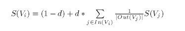
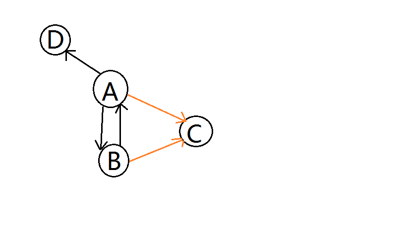
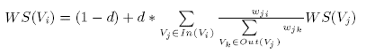
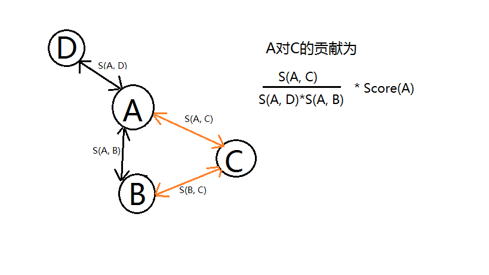

# 基于TextRank的文本摘要

## PageRank直观认识

- 搜索结果页面排序算法，也即评估页面重要程度
- 被引用次数越多的页面越重要，应该排在前面
- 页面作为节点，超链接作为边来构造有向图
- 排序过程即图中节点投票过程，越重要的页面投票权重越大

## PageRank - 页面的图模型

A页面含有页面B，C，D的链接；B页面含有页面A，C的链接；C页面含有页面D的链接；D页面含有页面A，B的链接

## PageRank - 计算过程

	为各个节点初始化一个分数
	
	迭代计算各个节点的分数
		节点V的分数由其其余跟V相邻的节点进行投票后产生

	根据节点分数对节点倒排序

## PageRank - 计算节点分数

## PageRank - 计算

<table>
<tr><td>文档</td><td>包含</td><td>被包含</td><td>初始分数</td></tr>
<tr><td>A</td><td>B,C,D</td><td>B,D</td><td>0.25</td></tr>
<tr><td>B</td><td>A,C</td><td>A,D</td><td>0.25</td></tr>
<tr><td>C</td><td>D</td><td>A,B</td><td>0.25</td></tr>
<tr><td>D</td><td>A,B</td><td>A,D</td><td>0.25</td></tr>
</table>

## PageRank - 一次迭代
	
	d = 0.85
	S(A) = 0.15 + 0.85 * ( S(B)/2 + S(D)/2 )
		 = 0.15 + 0.85 * ( 0.25/2 + 0.25/2 )
	S(B) = 0.15 + 0.85 * ( S(A)/3 + S(D)/2 )
		 = 0.15 + 0.85 * ( 0.25/3 + 0.25/2 )
	S(C) = 0.15 + 0.85 * ( S(A)/3 + S(B)/2 )
         = 0.15 + 0.85 * ( 0.25/3 + 0.25/2 )

## PageRank - 节点C分数

## PageRank - 为什么

- 被引用次数越多的页面越重要

	被引用次数越多的页面在计算分数时，有越多的页面参与	

- 越重要的页面在投票时权重越大

	某个页面对其它页面分数贡献，取决于其自身包含的链接数以及分数

# TextRank摘要

## TextRank跟PageRank关联

TextRank算法是将PageRank应用到文本排序的算法，步骤如下：

1. 从文本中提取文本单元作为图节点
2. 利用文本单元间的关系，为图添加边，可以是有向或无向，也可以是有权或无权的
3. 利用基于图的排序算法迭代至收敛
4. 根据节点的评分对文本单元进行排序

## TextRank摘要建模

- 句子作为节点
- 句子间的相似性作为边的权重，构造无向有权图
- 利用pagerank算法倒排序节点
- 抽取排名前k个句子作为摘要

## 摘要提取过程

1. 文本预处理，切分句子并Tokenize（过滤停止词，低频次，同义词合并）
2. 构建有权无向图，对句子两两计算相似性作为边权
3. 利用pagerank算法排序句子，并选取前k个作为摘要

## TextRank建模 - 文本预处理

因为句子之间的相似性度量是基于句子所含有的词汇，因此需要过滤噪音词汇，基于TF-IDF选取文档中非噪音词汇

## TextRank建模 - 句子相似性度量

最简单的相似性度量公式如下：

**注**：求句子相似性实质，即求句子谈论同一话题的可能性大小

## TextRank迭代 - 排序计算

PageRank算法在迭代计算时基于有向无权图，而TextRank中使用了无向有权图，下面是迭代中计算节点分数的公式：

## TextRank迭代 - 计算分数

## 摘要和搜索结果排序

<table>
<tr><td></td><td>实质</td><td>评价函数</td></tr>
<tr><td>搜索排序</td><td>根据页面重要性进行排序</td><td>被引用次数越多越重要，同时重要页面对其它页面投票权重较大</td></tr>
<tr><td>提取摘要</td><td>文档主题由文档中含有较多相似性具体的话题反映</td><td>句子的相似性句子越多越重要，越相似的句子对投票权重越高</td></tr>
</table>